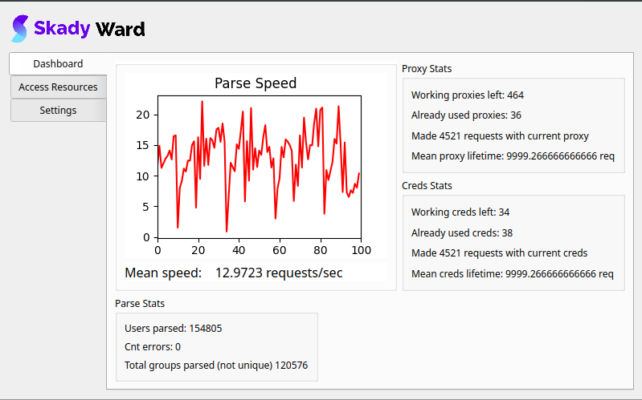
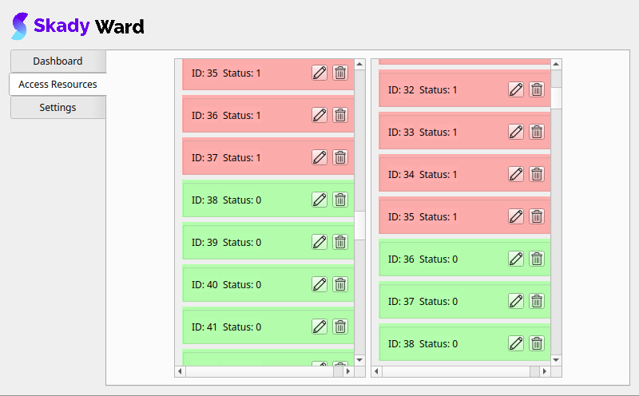
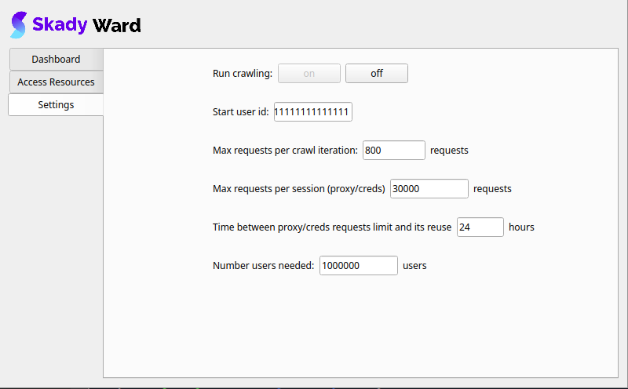

# Skady ward: GUI for [suvec crawling](https://github.com/ProtsenkoAI/skady-user-vectorizer/)
### Skady Ward:
1. Shows dashboard of crawling

2. Allows you to add/delete/edit proxies and credentials for web-crawling

3. Allows you to configure crawling

## Installation
1. git clone https://github.com/ProtsenkoAI/skady-user-vectorizer.git
2. python3 -m pip install pipenv
3. pipenv install
4. pipenv shell
5. pipenv install skady-user-vectorizer/dist/suvec-0.0.0-py3-none-any.whl
